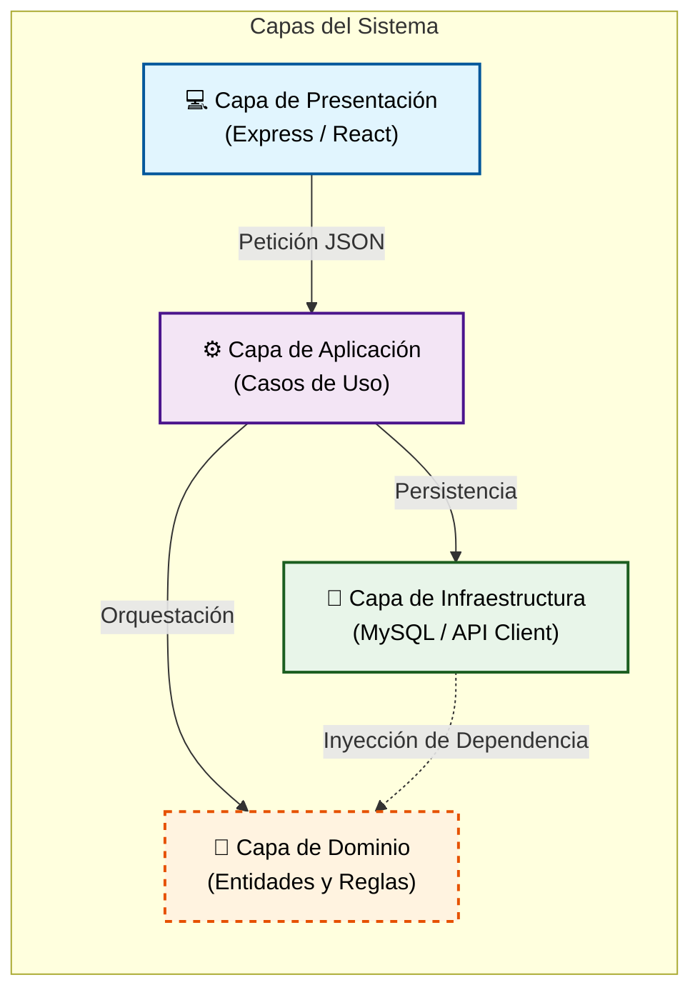

# ACTIVIDAD DE CONSTRUCCIÓN APLICADA (ACA)
## Sistema de Gestión de Citas Médicas - Arquitectura en Capas

---

### **1. Portada**

**Institución:** Corporación Unificada Nacional de Educación Superior (CUN)  
**Asignatura:** Arquitectura de Software  
**Proyecto:** Diseño e Implementación de un Sistema de Citas Médicas  
**Integrantes:**  
*   [Nombre del Integrante 1]
*   [Nombre del Integrante 2]
*   [Nombre del Integrante 3]
*   [Nombre del Integrante 4]
*   [Nombre del Integrante 5]

**Fecha de entrega:** 15 de marzo de 2026  
**Lugar:** Bogotá D.C., Colombia

---

### **2. Objetivo**
Aplicar el patrón de arquitectura en capas (Layered Architecture) para diseñar y desarrollar un sistema robusto, escalable y mantenible que gestione la asignación y control de citas médicas, cumpliendo con las reglas de negocio específicas de una clínica universitaria.

---

### **3. Diseño del Sistema Aplicando Arquitectura en Capas**

El sistema se ha estructurado siguiendo los principios de Clean Architecture, dividiendo las responsabilidades en cuatro capas claramente diferenciadas.

#### **Diagrama de Capas (Flujo de Datos)**

> [!TIP]
> **[Ver diagrama interactivo en alta resolución (HTML)](./arquitectura-detalle.html)**
> Para una mejor experiencia visual, abre el archivo adjunto en tu navegador.



---

#### **Interacción entre Capas**

| Capa | Icono | Color | Responsabilidad Principal |
| :--- | :---: | :---: | :--- |
| **Presentación** | 💻 | Azul | Capturar la intención del usuario y mostrar resultados. |
| **Aplicación** | ⚙️ | Morado | Dirigir el 'tráfico' y ejecutar la lógica de los Casos de Uso. |
| **Dominio** | 🧠 | Naranja | El corazón del sistema; contiene las reglas que no cambian. |
| **Infraestructura** | 💾 | Verde | Detalles técnicos y comunicación con el mundo exterior (BD). |

---

1.  **Capa de Presentación (Presentation):**
    *   Gestionar las solicitudes HTTP de entrada y formatear las respuestas de salida (JSON).
    *   Validar los esquemas de datos de entrada (Zod) antes de procesarlos.
    *   Administrar el enrutamiento de la aplicación y la comunicación con el cliente (CORS).

2.  **Capa de Aplicación (Application):**
    *   Implementar los casos de uso específicos del sistema (Registrar médico, agendar cita, etc.).
    *   Orquestar la interacción entre las entidades de dominio y los repositorios de infraestructura.
    *   Manejar la lógica de flujo de datos y excepciones de la aplicación.

3.  **Capa de Negocio / Dominio (Domain):**
    *   Definir las entidades centrales (Médico, Paciente, Cita) con sus estados y comportamientos intrínsecos.
    *   Hacer cumplir las reglas de negocio críticas (ej. no permitir citas en el pasado o cancelar solo citas activas).
    *   Definir interfaces (contratos) para los repositorios, permitiendo el desacoplamiento tecnológico.

4.  **Capa de Repositorio / Datos (Infrastructure):**
    *   Implementar la persistencia de datos mediante el acceso directo a la base de datos (MySQL).
    *   Realizar consultas CRUD y filtros específicos (ej. buscar disponibilidad por rango horario).
    *   Gestionar la conexión técnica con proveedores externos (Connection Pool).

---

### **4. Ejemplo de Implementación: Registrar Cita Médica**

A continuación se detalla cómo se divide el proceso de "Agendar Cita" a través de las capas:

#### **A. Capa de Dominio (Entidad Cita)**
*Define la lógica pura e independiente.*
```typescript
export class Cita {
    constructor(
        public readonly id: number,
        public medicoId: number,
        public pacienteId: number,
        public fechaHora: Date,
        public estado: 'ACTIVA' | 'CANCELADA'
    ) {}

    // Lógica de validación interna
    esPasada(): boolean {
        return this.fechaHora < new Date();
    }
}
```

#### **B. Capa de Aplicación (Caso de Uso AgendarCita)**
*Orquesta el proceso y valida reglas de negocio externas.*
```typescript
export class AgendarCitaUseCase {
    async execute(medicoId: number, pacienteId: number, fecha: Date) {
        if (fecha < new Date()) throw new Error("Cita en el pasado no permitida");

        // Verificar disponibilidad mediante repositorio
        const ocupado = await this.citaRepository.estaOcupado(medicoId, fecha);
        if (ocupado) throw new Error("El médico ya tiene una cita en ese horario");

        const cita = new Cita(0, medicoId, pacienteId, fecha, 'ACTIVA');
        return await this.citaRepository.save(cita);
    }
}
```

#### **C. Capa de Presentación (Controlador Express)**
*Punto de entrada para el usuario.*
```typescript
export class CitaController {
    async agendar(req: Request, res: Response) {
        try {
            const { medicoId, pacienteId, fecha } = req.body;
            const nuevaCita = await this.agendarUseCase.execute(medicoId, pacienteId, new Date(fecha));
            res.status(201).json(nuevaCita);
        } catch (error) {
            res.status(400).json({ error: error.message });
        }
    }
}
```

#### **D. Capa de Repositorio (Infraestructura MySQL)**
*Detalle técnico de persistencia.*
```typescript
export class MysqlCitaRepository implements ICitaRepository {
    async save(cita: Cita) {
        const query = "INSERT INTO citas (medico_id, paciente_id, fecha_hora) VALUES (?,?,?)";
        await pool.execute(query, [cita.medicoId, cita.pacienteId, cita.fechaHora]);
    }
}
```

---

### **5. Desacoplamiento en el Diseño**

El desacoplamiento se asegura mediante la **Inversión de Dependencias**. La capa de Aplicación no depende de la base de datos MySQL directamente, sino de una **Interfaz (ICitaRepository)** definida en el Dominio. 
Esto permite que:
*   Si cambiamos MySQL por PostgreSQL, solo modificamos la Capa de Infraestructura.
*   La lógica de negocio (Dominio) es testeable sin necesidad de una base de datos real.
*   El Frontend y Backend pueden evolucionar de forma independiente siempre que respeten el contrato de la API.

---

### **6. Conclusiones**
*   La arquitectura en capas facilita el mantenimiento del sistema a largo plazo, ya que los cambios en una capa (como la base de datos o el framework web) tienen un impacto mínimo en las demás.
*   La separación de responsabilidades mejora la legibilidad del código y permite un trabajo colaborativo más eficiente entre desarrolladores.
*   Cumplir con las reglas de negocio en la capa de dominio asegura que la integridad de los datos no dependa de validaciones externas vulnerables.

---

### **7. Referencias Bibliográficas**
*   Martin, R. C. (2017). *Clean Architecture: A Craftsman's Guide to Software Structure and Design*. Prentice Hall.
*   Vernon, V. (2013). *Implementing Domain-Driven Design*. Addison-Wesley Professional.
*   Evans, E. (2003). *Domain-Driven Design: Tackling Complexity in the Heart of Software*. Addison-Wesley.
